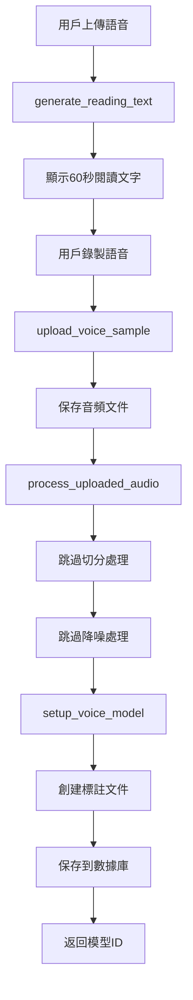
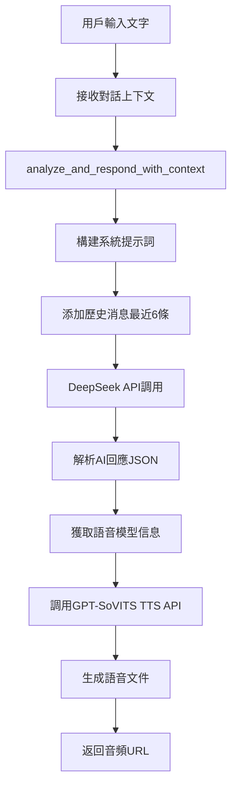
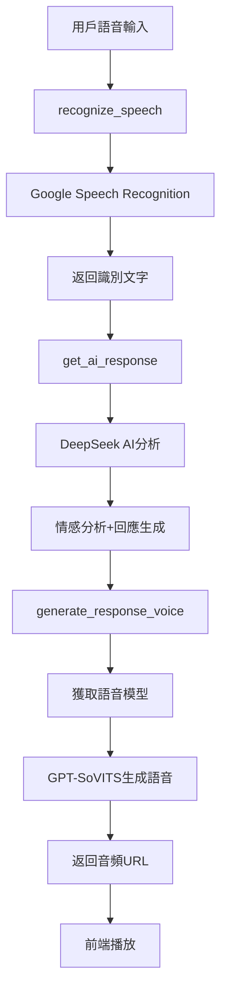
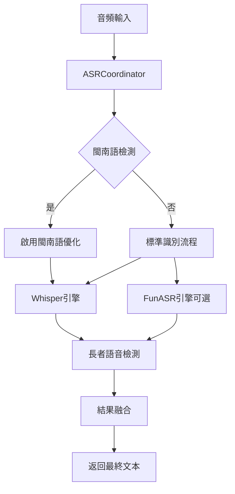
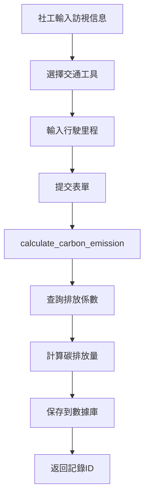
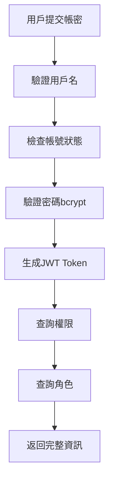

# Flask-AICares 核心業務流程分析

## 一、語音克隆完整流程

### 1.1 語音樣本上傳與處理流程



**關鍵代碼路徑：**
```
routes/voice_clone.py::upload_voice_sample()
  └─> services/gpt_sovits_service.py::process_uploaded_audio()
      ├─> _slice_audio() [簡化：直接返回原路徑]
      └─> _denoise_audio() [簡化：直接返回原路徑]
  └─> services/gpt_sovits_service.py::setup_voice_model()
      ├─> _extract_text_features() [創建.list標註文件]
      ├─> _extract_ssl_features() [已跳過]
      ├─> _extract_semantic_tokens() [已跳過]
      └─> _setup_tts_inference() [已跳過]
  └─> database.py::save_voice_model_info()
```

**數據流：**
```python
# 輸入
{
    "audio_file": <WAV文件>,
    "staff_code": "SW001",
    "reference_text": "使用軟件者、傳播軟件導出的聲音者自負全責..."
}

# 處理結果
{
    "original_path": "audio_uploads/SW001/SW001_uuid_sample.wav",
    "sliced_path": "audio_uploads/SW001/SW001_uuid_sample.wav",  # 簡化：同原路徑
    "denoised_path": "audio_uploads/SW001/SW001_uuid_sample.wav", # 簡化：同原路徑
    "staff_code": "SW001",
    "filename": "SW001_uuid_sample.wav"
}

# 數據庫記錄
voice_models {
    id: "uuid",
    staff_code: "SW001",
    original_audio_path: "...",
    processed_audio_path: "...",
    reference_text: "...",
    model_status: "ready"
}
```

### 1.2 語音回應生成流程（多輪對話）



**關鍵代碼路徑：**
```
routes/voice_clone.py::generate_response_voice()
  └─> services/ai.py::analyze_and_respond_with_context()
      ├─> build_system_prompt() [動態構建提示詞]
      ├─> build_user_prompt() [構建用戶提示]
      └─> OpenAI Client.chat.completions.create()
  └─> database.py::get_voice_model_by_staff()
  └─> services/tts.py::gpt_sovits_tts.generate_speech()
      └─> POST http://127.0.0.1:9880/tts
```

**多輪對話參數：**
```python
{
    "user_input": "我今天心情不好",
    "staff_code": "SW001",
    "response_style": "friendly",      # friendly/professional/casual/detailed
    "conversation_mode": "continuous", # continuous/qa/creative
    "conversation_context": [          # 對話歷史
        {"role": "user", "content": "你好"},
        {"role": "assistant", "content": "你好，我是AI客服..."},
        ...
    ],
    "conversation_round": 2            # 對話輪次
}
```

**AI回應策略：**
```python
# 溫度參數映射
temperature_map = {
    'friendly': 0.8,      # 更自然隨意
    'professional': 0.5,  # 更穩定專業
    'casual': 0.9,        # 最隨意創意
    'detailed': 0.6       # 詳細但穩定
}

# 提示詞策略
if conversation_round == 0:
    "這是對話的開始，請友好地打招呼..."
elif conversation_round < 3:
    "這是對話的前期階段，請深入了解..."
else:
    "這是深度對話階段，請提供更具體的建議..."
```

---

## 二、語音對話完整流程

### 2.1 完整對話鏈路



**一站式API：**
```
routes/voice_chat.py::full_conversation()
  └─> 步驟1: 語音識別
      └─> SpeechRecognition.recognize_google(language='zh-TW')
  └─> 步驟2: AI分析
      └─> services/ai.py::analyze_and_respond()
  └─> 步驟3: 語音合成
      └─> services/gpt_sovits_service.py::generate_voice_response()
```

**數據流示例：**
```python
# 輸入：音頻文件
audio_file = <WAV/MP3文件>
staff_code = "SW001"

# 步驟1輸出：識別文字
user_text = "我今天感覺有點累"

# 步驟2輸出：AI分析
{
    "sentiment": "消極",
    "response": "聽起來你今天過得挺辛苦的，要不要跟我聊聊發生了什麼事呢？...",
    "confidence": 0.85
}

# 步驟3輸出：語音
{
    "audio_url": "/genvoice/SW001_1699999999.wav",
    "method": "gpt_sovits"  # 或 "mock"
}
```

### 2.2 語音識別優化（Python 3.13兼容）

**FFmpeg音頻轉換流程：**
```python
# services/speech.py
convert_audio_to_wav()
  └─> 1. 保存臨時輸入文件
  └─> 2. FFmpeg轉換
      ffmpeg -i input -ar 16000 -ac 1 -f wav output.wav
  └─> 3. 讀取轉換後的WAV
  └─> 4. 清理臨時文件
```

**識別參數調優：**
```python
recognizer.energy_threshold = 10
recognizer.dynamic_energy_threshold = True
recognizer.pause_threshold = 0.8
```

---

## 三、ASR語音識別雙引擎流程

### 3.1 協調器架構



**關鍵組件：**
```
services/asr/coordinator.py::ASRCoordinator
  ├─> whisper_engine.py::WhisperEngine
  ├─> funasr_engine.py::FunASREngine [可選]
  ├─> minnan_detector.py::MinnanDetector
  ├─> elderly_detector.py::ElderlyDetector
  └─> fusion.py::ResultFusion
```

### 3.2 識別流程

**單音頻識別：**
```python
# routes/asr.py::recognize_audio()
POST /api/asr/recognize
{
    "file": <音頻文件>,
    "language_hint": "zh-TW",
    "return_details": true,
    "enable_minnan_optimization": true
}

# 處理流程
coordinator.recognize(audio_data, options)
  └─> 1. 檢測語言特徵
      └─> minnan_detector.detect()
  └─> 2. 檢測長者特徵
      └─> elderly_detector.detect()
  └─> 3. Whisper識別
      └─> whisper_engine.recognize()
  └─> 4. FunASR識別（可選）
      └─> funasr_engine.recognize()
  └─> 5. 結果融合
      └─> fusion.fuse_results()

# 返回結果
{
    "success": true,
    "text": "識別的文本",
    "confidence": 0.85,
    "language": "zh",
    "audio_duration": 5.2,
    "processing_time": 1.5,
    "details": {
        "is_minnan": false,
        "is_elderly": true,
        "whisper_result": {...},
        "funasr_result": {...}
    }
}
```

**批次識別：**
```python
POST /api/asr/batch-recognize
{
    "files": [<file1>, <file2>, ...],
    "language_hint": "zh",
    "return_details": false
}

# 異步並行處理
coordinator.recognize_batch(audio_data_list, options)
  └─> asyncio.gather(*[recognize(data) for data in audio_data_list])

# 返回
{
    "success": true,
    "results": [
        {"index": 0, "text": "...", "confidence": 0.85},
        {"index": 1, "text": "...", "confidence": 0.90},
        ...
    ],
    "total": 3,
    "successful": 3,
    "failed": 0
}
```

---

## 四、碳排放追蹤流程

### 4.1 訪視記錄創建流程



**關鍵代碼：**
```python
# routes/carbon_tracking.py::create_visit_record()
POST /carbon/api/visit-records
{
    "visit_date": "2024-11-11",
    "social_worker_id": "SW001",
    "social_worker_name": "王小明",
    "elder_id": "E001",
    "elder_name": "李老先生",
    "visit_type": "家訪",
    "transport_type": "機車",
    "distance": 15.5,
    "travel_time": 30,
    "start_location": "機構",
    "end_location": "長者家中",
    "notes": "定期關懷訪視"
}

# 處理流程
database_carbon_tracking.py::add_visit_record()
  └─> calculate_carbon_emission("機車", 15.5)
      └─> SELECT coefficient FROM emission_coefficients 
          WHERE transport_type = '機車'
      └─> coefficient = 0.0695 kg CO2e/km
      └─> carbon_emission = 15.5 * 0.0695 = 1.077 kg CO2e
  └─> INSERT INTO visit_records (...)
```

### 4.2 統計分析流程

**月度統計：**
```python
# routes/carbon_tracking.py::get_monthly_statistics()
GET /carbon/api/monthly-statistics?year=2024&month=11

# 數據庫查詢
database_carbon_tracking.py::get_monthly_statistics()
  └─> 訪視統計
      SELECT COUNT(*), SUM(distance), SUM(carbon_emission)
      FROM visit_records
      WHERE year=2024 AND month=11
  └─> AI關懷統計
      SELECT COUNT(*)
      FROM ai_care_records
      WHERE year=2024 AND month=11

# 返回
{
    "year": 2024,
    "month": 11,
    "physical_visits": 120,
    "total_distance": 1850.5,
    "total_carbon_emission": 128.6,
    "ai_care_count": 80
}
```

**統計摘要：**
```python
GET /carbon/api/statistics-summary?start_date=2024-06-01&end_date=2024-09-30

# 返回
{
    "total_visits": 480,
    "unique_elders": 150,
    "total_distance": 7200.0,
    "total_emission": 500.4,
    "avg_distance": 15.0
}
```

**交通工具分布：**
```python
GET /carbon/api/transport-distribution?start_date=2024-06-01&end_date=2024-09-30

# 返回
[
    {
        "transport_type": "機車",
        "count": 320,
        "total_distance": 4800.0,
        "total_emission": 333.6
    },
    {
        "transport_type": "汽車",
        "count": 100,
        "total_distance": 1800.0,
        "total_emission": 333.0
    },
    {
        "transport_type": "大眾運輸",
        "count": 60,
        "total_distance": 600.0,
        "total_emission": 17.7
    }
]
```

### 4.3 數據匯出流程

**Excel匯出：**
```python
GET /carbon/api/export/excel?keyword=&worker_id=SW001&start_date=2024-01-01

# 處理流程
routes/carbon_tracking.py::export_excel()
  └─> 1. 查詢數據
      └─> search_visit_records(filters)
  └─> 2. 創建Excel Workbook
      └─> openpyxl.Workbook()
  └─> 3. 設置樣式
      └─> 標題樣式：綠色背景、白色文字
      └─> 數據對齊
  └─> 4. 寫入數據
  └─> 5. 調整欄寬
  └─> 6. 生成文件名
      └─> 訪視記錄_20241111_153000.xlsx
  └─> 7. 返回文件流
```

**CSV匯出：**
```python
GET /carbon/api/export/csv?keyword=王小明

# UTF-8 BOM處理
output_bytes = '\ufeff' + csv_content  # Excel中文兼容
```

---

## 五、認證授權流程

### 5.1 用戶登入流程



**代碼實現：**
```python
# routes/auth.py::login()
POST /api/auth/login
{
    "username": "admin",
    "password": "admin123"
}

# 處理流程
database.py::get_user_by_username()
  └─> SELECT * FROM users WHERE username = 'admin'

database.py::verify_password()
  └─> bcrypt.checkpw(password, password_hash)

flask_jwt_extended.create_access_token()
  └─> expires_delta = 8小時

flask_jwt_extended.create_refresh_token()
  └─> expires_delta = 30天

database.py::get_user_permissions()
  └─> SELECT permissions.name
      FROM permissions
      JOIN role_permissions ON permissions.id = role_permissions.permission_id
      JOIN user_roles ON role_permissions.role_id = user_roles.role_id
      WHERE user_roles.user_id = ?

# 返回
{
    "message": "登入成功",
    "access_token": "eyJ...",
    "refresh_token": "eyJ...",
    "user": {
        "id": "uuid",
        "username": "admin",
        "email": "admin@example.com",
        "full_name": "系統管理員",
        "permissions": [
            "perm_staff_read",
            "perm_staff_create",
            ...
        ],
        "roles": ["admin"]
    }
}
```

### 5.2 權限驗證流程

**裝飾器鏈：**
```python
# routes/staff.py::add_staff()
@staff_bp.route('', methods=['POST'])
@token_required
@permission_required('perm_staff_create')
def add_staff():
    ...

# 執行順序
1. @token_required
   └─> verify_jwt_in_request()
   └─> 驗證JWT Token有效性

2. @permission_required('perm_staff_create')
   └─> get_jwt_identity() # 獲取user_id
   └─> get_user_permissions(user_id)
   └─> 檢查 'perm_staff_create' in permissions
   └─> 403 Forbidden if missing
```

**角色驗證：**
```python
@role_required('admin')
def admin_only_function():
    ...

# 驗證流程
auth.py::role_required()
  └─> get_user_roles(user_id)
  └─> 檢查 role_name in user_roles
```

---

## 六、情緒識別流程

### 6.1 單音頻分析

```python
# routes/emotion.py::analyze_emotion()
POST /api/emotion/analyze/<audio_id>
{
    "method": "advanced"  # or "basic"
}

# 處理流程
database.py::get_audio_by_id()
  └─> 獲取音頻文件路徑

if method == 'advanced':
    services/emotion_recognition_advanced.py
      └─> Wav2Vec2模型
else:
    services/emotion_recognition.py
      └─> 基於Librosa特徵

# 基礎方法流程
emotion_recognizer.predict_emotion()
  └─> 1. 載入音頻
      └─> librosa.load(audio_path, duration=10)
  └─> 2. 提取特徵
      ├─> RMS能量
      ├─> 零交叉率
      ├─> 光譜質心
      └─> 節拍(Tempo)
  └─> 3. 規則分類
      if rms_energy > 0.02 and tempo > 120:
          emotion = "happy"
      elif rms_energy < 0.01 and tempo < 90:
          emotion = "sad"
      ...

# 返回
{
    "predicted_emotion": "happy",
    "confidence": 0.75,
    "features": {
        "tempo": 128.5,
        "spectral_centroid": 2500.3,
        "rms_energy": 0.025,
        "zero_crossing_rate": 0.08
    },
    "audio_info": {
        "id": "audio_id",
        "name": "test.wav",
        "duration": 10.5,
        "staff_name": "王小明"
    }
}
```

### 6.2 批量分析

```python
POST /api/emotion/batch-analyze
{
    "audio_ids": ["id1", "id2", "id3"],
    "method": "basic"
}

# 處理流程
for audio_id in audio_ids:
    try:
        emotion_result = predict_emotion(file_path)
        results.append(emotion_result)
    except:
        results.append({"error": "..."})

# 返回
{
    "message": "批量分析完成，共處理 3 個音檔",
    "results": [
        {"audio_id": "id1", "predicted_emotion": "happy", ...},
        {"audio_id": "id2", "predicted_emotion": "sad", ...},
        {"audio_id": "id3", "error": "音頻檔案不存在"}
    ]
}
```

---

## 七、關鍵優化點

### 7.1 簡化處理策略

**原因：提高穩定性和響應速度**

1. **語音處理簡化**
   - ❌ 跳過音頻切分
   - ❌ 跳過降噪處理
   - ❌ 跳過SSL特徵提取
   - ❌ 跳過語義Token提取
   - ✅ 僅創建標註文件
   - ✅ 直接使用原始音頻

2. **回退機制**
   - GPT-SoVITS不可用 → 模擬模式
   - 參考音頻不存在 → 使用mockvoice
   - API超時 → 120秒timeout

### 7.2 多輪對話優化

1. **上下文管理**
   - 僅保留最近6條消息
   - 避免token超限

2. **動態提示詞**
   - 根據輪次調整策略
   - 根據風格調整溫度

3. **情感連續性**
   - 分析對話歷史情緒
   - 保持回應一致性

### 7.3 性能優化

1. **異步處理**
   - ASR批次識別：asyncio.gather()
   - 並行處理多個音頻

2. **快取機制**
   - 語音模型快取
   - 識別結果快取

3. **資源管理**
   - 臨時文件自動清理
   - 連接池管理

---

## 總結

本項目的核心流程設計特點：

1. **模組化清晰**：每個功能獨立封裝
2. **錯誤處理完善**：多層回退機制
3. **擴展性強**：條件式載入、插件化設計
4. **用戶體驗優先**：簡化處理提高響應速度
5. **數據驅動**：完整的統計分析功能
